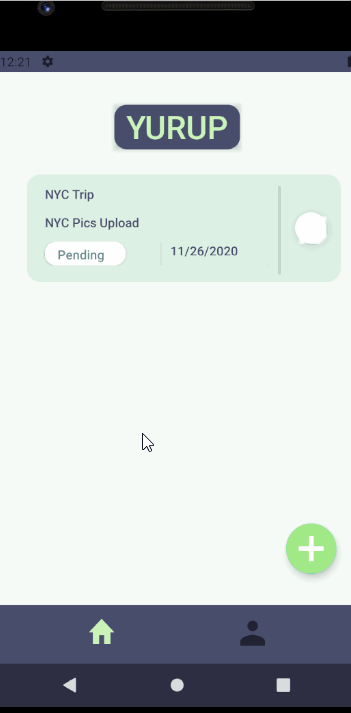

Unit 8: Group Milestone 
===

# ***YURUP***
This is a temporary app name

## Table of Contents
1. [Overview](#Overview)
1. [Product Spec](#Product-Spec)
1. [Wireframes](#Wireframes)

## Overview
### Description
YURUP, is a mobile productivity application that keeps track of the users' goals. This app allows the user to invite friends and family members to join a goal/challenge they have created. Through the app, users can send reminders to friends/family members to keep up with the challenge they committed to. It is like checking in with your close ones to see how they are doing and are they keeping up with their goals. In a rough time, like now, the productivity level is low. This application will help increase productivity and bring a sense of support from friends and family.

### App Evaluation
- **Category:** Productivity / Social Networking
- **Mobile:** This app would be primarily developed for mobile but would perhaps be just as viable on a computer. Functionality wouldn't be limited to mobile devices, however mobile version could more emphasized due to the mobility.
- **Story:** Sharing goals/challenges, inviting people to participate in a challenge that was created, Reminding each other to complete the challenge.
- **Market:** It can be used by anyone that would like to achieve a goal/ challenge. The user can choose to invite others to join the challenge so that they can support and motivate each other to accomplish their mutual goals. User doesn't have to share their goals. 
- **Habit:** This app could be used as often or unoften as the user wanted depending on how many challenges (ongoing) they have created for themselves or with their friends/ family members. 
- **Scope:** In the beginning stage of creating this app, it will allow the user to create short term goals and check them off their list. In the next stage, it will allow the user to create a daily/weekly/monthly challenge which means the user would need to check off that they accomplished the challenge of the day/week/month. Afterward, we will implement more stretch stories for the application, such as badges for the milestone, a timer .. etc

### 1. User Stories (Required and Optional)

**Required Must-have Stories**

- [] User login and access their information
- [] Create a challenge/goal 
- [] Instead of creating a challenge, user can join a created challenge with an invitation code.
- [] Categorizing the challenges
- [] Allow user to edit the challenge/goals details
- [] Set reminder and send notification to participants reminding them to keep up with their goals .

**Optional Nice-to-have Stories**

- [] Create an activity page with the history of completed activities.
- [] Badge award for the milestones
- [] Implement a detailed timer to keep track of their challenges/goals.

### 2. Screen Archetypes

- [x] Login 
- [x] Home Screen - a list of goals/challenges the user has been participating in. 
   - [] User can select what goals/challenges they have completed
- [x] Create Challenge 
  - [] User can create a challenge with basic information or 
  - [] User can join a challenge that has been made (with an invitation code)
- [x] Profile Screen 
  - [] Allows user to update their profile information 
- [] Activity detail Screen.
  - [] Allows users to read more about the challenges, such as when is it due? when did it start? who is participating in this challenge? what is the code? 

### 3. Navigation

**Tab Navigation** (Tab to Screen)

- [x] Home
- [x] Create
- [x] Profile

**Flow Navigation** (Screen to Screen)
* Forced Log-in -> Account creation if no log in is available
* View activities in home screen
* Create new activites if there's no exsiting ones.
* Join existing activities with join code.
* Edit profile under profile setting
* Following figma project displays the prototype:
https://www.figma.com/file/wI6YONc1IOWm05iBZCx1Xl/YURUP-ANDROID-PROJECT?node-id=0%3A1

# Schema
## Models
**User**
|Property|Type|Description|
|---|---|---|
|u_id|String|unique id for the user|
|username|String|unique string for user to log in|
|password|Character|array of characters for user to log in|
|profile picture|File|image for the user profile|

**Challenge**
|Property|Type|Description|
|---|---|---|
|c_id|String|unique id for a challenge activity|
|description|String|activity description|
|titile|String|activity title|
|startDate|DateTime|date and time when the activity starts|
|endDate|DateTime|date and time when the activity is completed|
|joinCode|String|code for joining an existing activity|
|status|String|current activity status|
|creator|String|host user of an activity|
|isActive|Boolean|whether the activity is active|

**Participant**
|Property|Type|Description|
|---|---|---|
|userId|String|unique id for the user|
|challengeId|String|unique id for a challenge activity|
|status|String|current activity status|

## Networking

- Home Screen

  |HTTP Verb|Endpoint|Description|
  |---|---|---|
  |`Get`|/home|query/populates list of all challenge activities created and joined|
  |`Put`|/updateChallenge/c_id|update the challenge activity status on the post|
  |`Delete`|/deleteChallenge/c_id|delete an existing challenge (stretch story)|
  
- Create Challenge
  |HTTP Verb|Endpoint|Description|
  |---|---|---|
  |`Post`|/createChallenge|create a new entry on the challenge table and join it immediately|
  
- Join Challenge
  |HTTP Verb|Endpoint|Description|
  |---|---|---|
  |`Post`|/joinChallenge/joinCode|adds a new entry to the participant table|
  
- Detail Page
  |HTTP Verb|Endpoint|Description|
  |---|---|---|
  |`Put`|/detailChallenge/c_id|update the information of the challenge activity|
  
- Profile (Stretch)
  |HTTP Verb|Endpoint|Description|
  |---|---|---|
  |`Get`|/profile|query the current user object|
  |`Put`|/updateProfile/u_id|update the information of the challenge activity|

- Login Screen
  |HTTP Verb|Endpoint|Description|
  |---|---|---|
  |`Post`|/login|queries user table and verifies the credentials, routes to that user's home page|
  
  ## Wireframes
   
  
  ## Progress
   
  
  ### [BONUS] Digital Wireframes & Mockups
  
  
  ### [BONUS] Interactive Prototype
  

